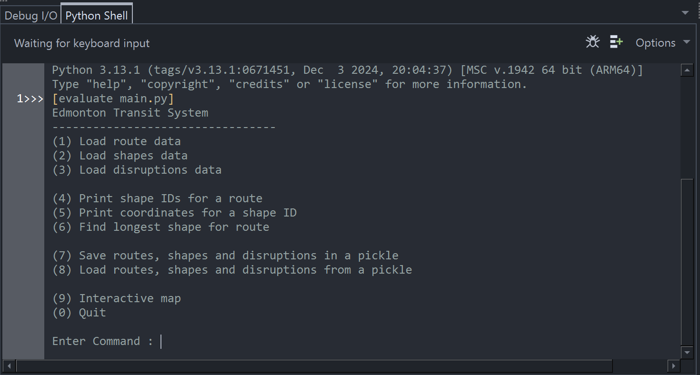
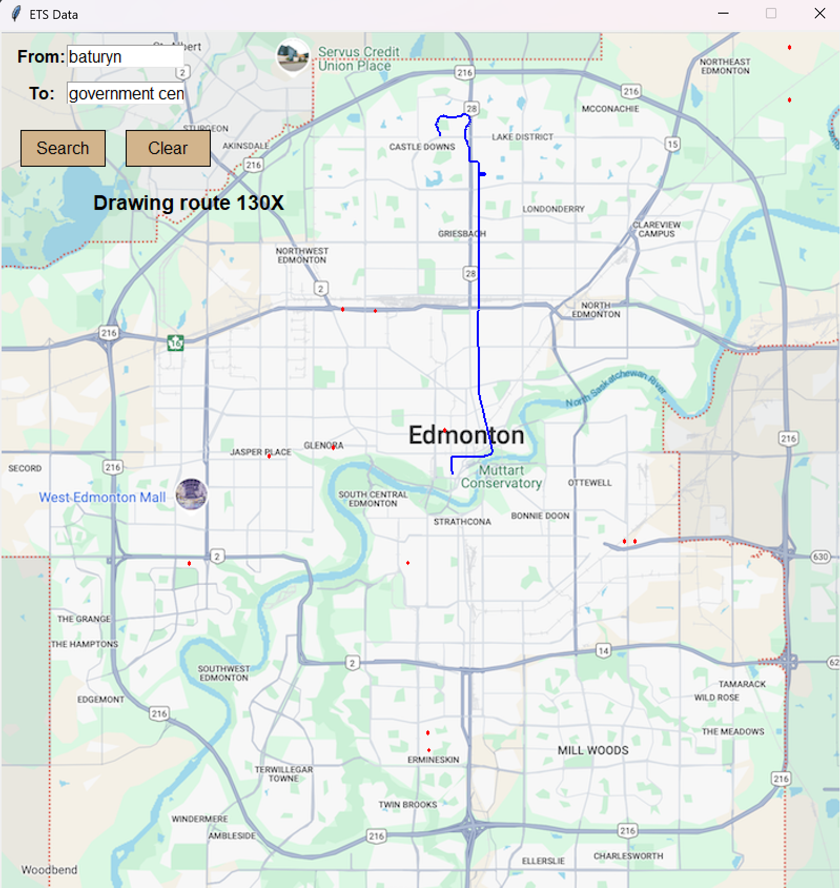

# ETS Visualizer

A Python project to visualize **Edmonton Transit Service (ETS)** routes and traffic disruptions.  
This tool loads transit data, maps routes, and highlights disruptions on an interactive map of Edmonton.

---

## 🚀 Features
- Load ETS route data and shapes from GTFS-style files.
- Display **all route shape IDs** and coordinates.
- Find the **longest shape** for a given route.
- View an **interactive map** with:
  - ETS routes drawn in blue.
  - Traffic disruptions shown as red circles.
- Save & load data using **pickle**.

---

## 🖥️ Demo Screenshots

### Main Menu


### Route Visualization


---

## ⚙️ Installation

Clone the repository:

```bash
git clone https://github.com/khereis200-code/ets-visualizer.git
cd ets-visualizer
